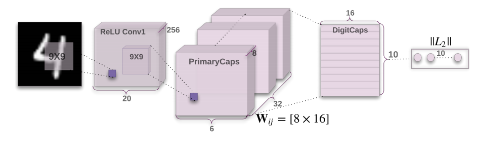
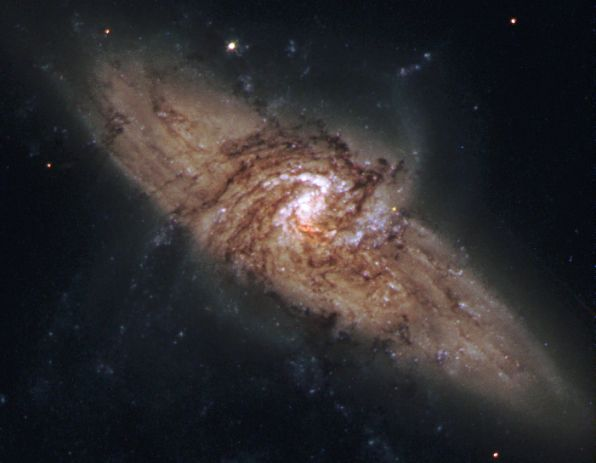
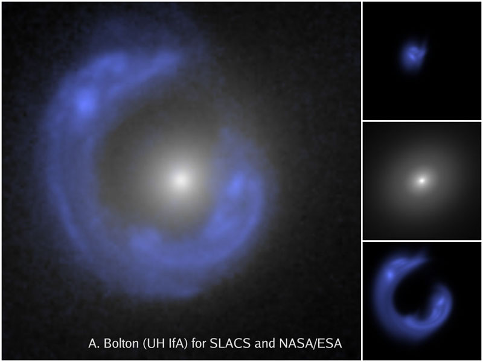
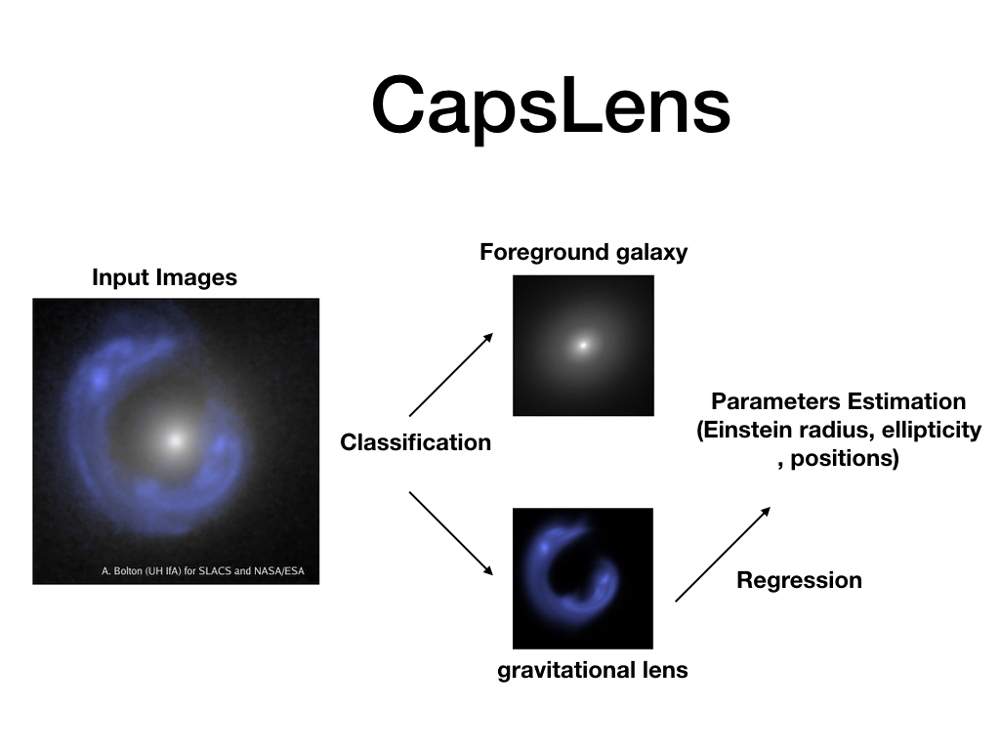

# Estimate Gravitational Lensing with Capusle Network

---

# Introduction

Author: Joshua Yao-Yu Lin\*, Hang Yu\*, Gilbert Holder\*

A capsule network [1] is a new type of neural network proposed by Geoffrey Hinton. Hinton argues that the convolution neural network has several problems; for example, they cannot handle the orientation information very well. With a capsule network, the neurons are gathered in a group called capsule, and they output a “vector” instead of scalars.

<p align="center">
  
</p>

*Figure 1. Architecture of Capsule Network with dynamic routing*

Therefore, a capsule network can remember the “pose” of the object in images. For example, even when digits are overlapping, capsule networks seem to recognize them with good accuracy.

Several research groups in astrophysics have started using deep neural networks, in particular convolutional neural network (CNN) to deal with astrophysical images (including recent work by a former graduate student of the PI [2]). However, no one has analyzed astrophysical images with Capsule Network yet. We aim to pioneer the use of capsule networks for astronomical research.

In the area of astronomical observations, there are often cases where our target of interest is overlapping with other objects. It is often the case that a galaxy is overlapping another galaxy (an extreme example is shown in Fig.2 [3]) purely due to statistical chance.

<p align="center">
  
</p>

*Figure.2 : NGC 3314: When Galaxies Overlap*

There are some particular cases where the foreground object is gravitationally distorting the image of the background object (e.g., Figure.3), leading to a unique opportunity to measure the gravitational properties of the foreground galaxy. Our research group has been actively using these systems [5] as a way to learn more about the mysterious dark matter that dominates the mass density of the universe but has yet to be detected in terrestrial laboratories.

<p align="center">
  
</p>

*Figure.3: The Sloan Lens ACS (SLACS)  Lens, SDSSJ1430: A Galaxy Einstein Ring*

We would start with images of strong gravitational lensing. According to Einstein’s General Relativity, light from distant galaxies would be bent when passing through foreground mass (e.g. galaxies, or galaxies cluster, dark matter halo...etc) and would form an arc like image on the sky. By studying gravitational lensing, we could tell the underlying dark matter distribution in the foreground galaxies, and hence helps up understanding the universe. We would like to build our pipeline based on [2].

<p align="center">
  
</p>

*Figure 4. A sketch about how CapsLens work: First we do a classification task on the input images into foreground galaxy and gravitational lens. Second, we use the regression task on the parameters Estimation.*

We plan to apply Capsule Networks on strong gravitational images. To perform the task, we would like to use Nvidia GPU to train our network.

We plan to implement our methods in Python programming language and TensorFlow machine learning library. TensorFlow offers an option to use GPU implementation of matrix/tensor operations, which is excellent to deep neural net (DNN) training. Through our study, we find TensorFlow is using CUDA libraries---cuDNN and cuBLAS to optimize its deep learning performance on Nvidia GPU. This is why we would like to run our program on a Nvidia GPU.

The experiment we plan to do involves three phases. (i) Training (ii) Validation/Testing (iii) Refining the model. The dataset we plan to work on is bigger than 6GB for sure that contains 500,000 gravitational lensing samples. We plan to train various modification of the Capsule Networks from, It would be interesting to experiment with deeper layers of Capsules, different numbers of pose vectors, and the number of routing iterations.

To validate our experiment, we would compare its performance against previous work by comparing their accuracy and processing speed a single sample. By combining the prediction of multiple trained model as way to refine prediction, we would expect to see a marginal improvement on accuracy, which by itself is important because our work could potentially be deployed in future researches.

--
[1] Sabour, S., Frosst, N., & Hinton, G. E. (2017). Dynamic routing between capsules. In Advances in Neural Information Processing Systems (pp. 3859-3869).

[2] Hezaveh, Y. D., Levasseur, L. P., & Marshall, P. J. (2017). Fast automated analysis of strong gravitational lenses with convolutional neural networks. Nature, 548(7669), 555.

[3] Credit: W. Keel & R. White (Univ. Alabama, Tuscaloosa),
Hubble Heritage Team (STScI/ AURA), ESA, NASA, [https://apod.nasa.gov/apod/ap050507.html](https://apod.nasa.gov/apod/ap050507.html)

[4] Credit: A. Bolton (UH/IfA) for SLACS and NASA/ESA, [https://apod.nasa.gov/apod/ap080728.html](https://apod.nasa.gov/apod/ap050507.html)

[5] Hezaveh, Y. D., Dalal, N., Marrone, D. P., Mao, Y. Y., Morningstar, W., Wen, D., ... & Kemball, A. (2016). Detection of lensing substructure using ALMA observations of the dusty galaxy SDP. 81. The Astrophysical Journal, 823(1), 37.


---

# Install

This project is developed for Python3.5 interpreter on linux machine. Using Anaconda virtual environment is recommended.

To install dependencies, simply run:

```pip install -r requirment.txt```

This project uses TensorFlow, a machine learning library developed and maintained by Google in principle.

We will be using tensorflow version 1.4.0 (a subtle difference has been observed in tensorflow 1.7.0, see ```network.py``` for details),

```pip install https://storage.googleapis.com/tensorflow/linux/cpu/tensorflow-1.4.0-cp35-cp35m-linux_x86_64.whl```

users can choose to install its GPU optimized version accordingly,

```pip install https://storage.googleapis.com/tensorflow/linux/gpu/tensorflow_gpu-1.4.0-cp35-cp35m-linux_x86_64.whl```

To install cv2 in Anaconda (optional):

```conda install -c menpo opencv=2.4.11```

# Train

Simply run this in terminal:

```python main.py --mode=train --model=cap```

To train a CNN baseline that has similar number of parameters (2M),

```python main.py --mode=train --model=cnn```

# Test

To test the initial Root Mean Square(RMS) error for an untrained network,

```python main.py --mode=test --model=cap```

If you have finished training and have checkpoint files under ```./savedmodels```,

```python main.py --mode=test --model=cap --restore```
